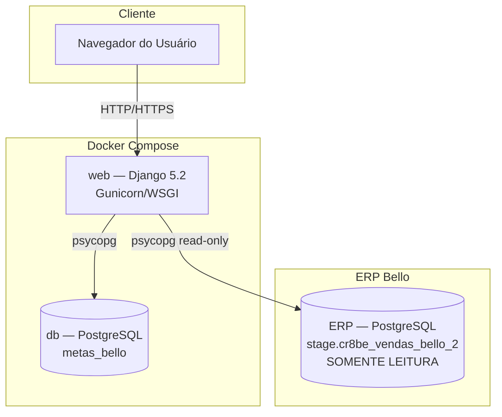
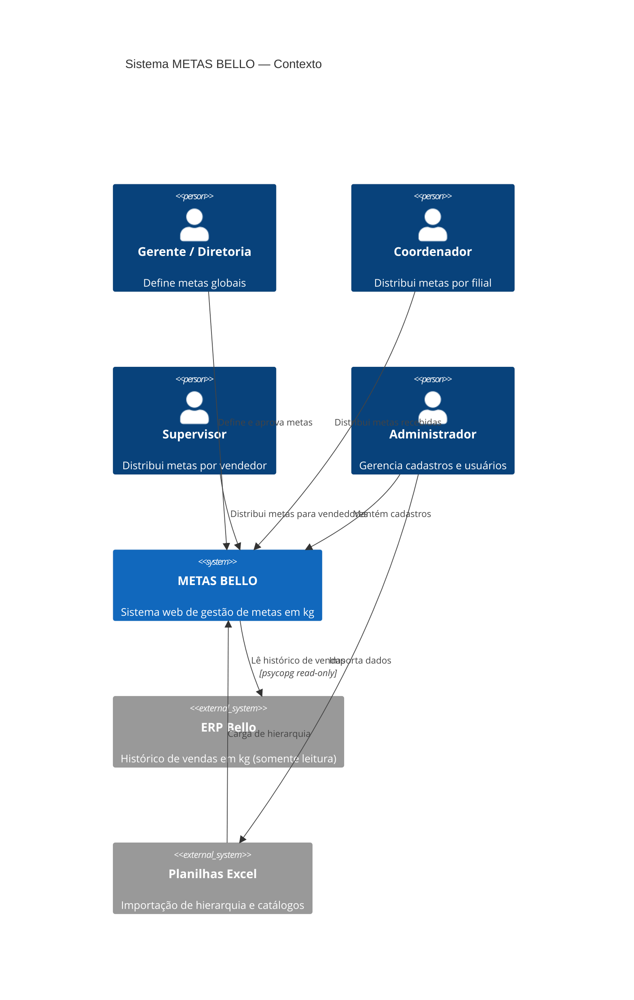
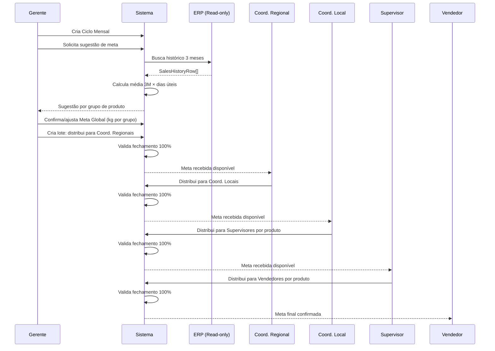
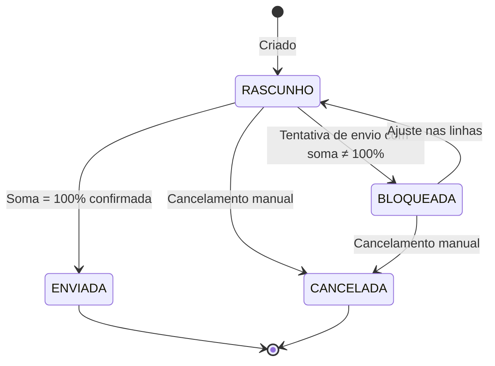
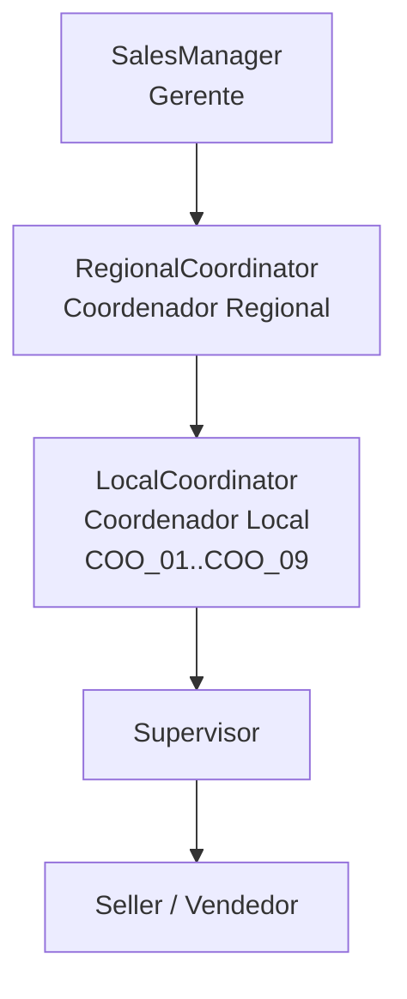
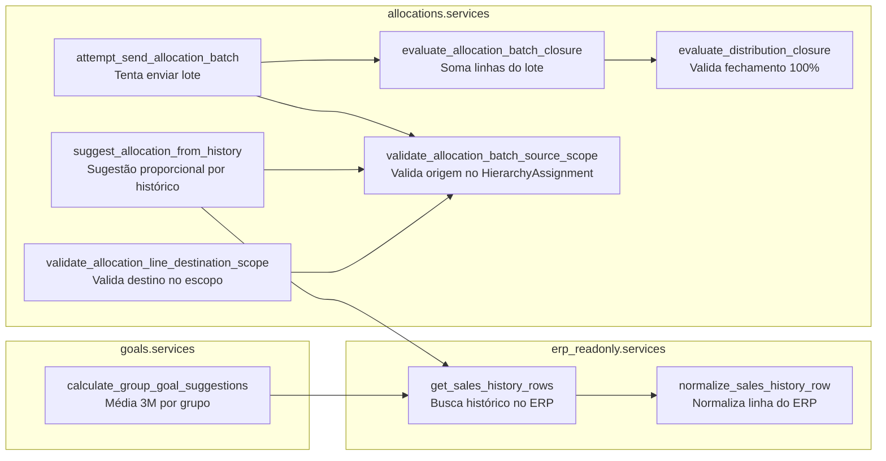

# Sistema METAS BELLO — Documentação Técnica Completa

**Versão:** 1.0  
**Data:** 2026-06-15  
**Responsável:** Equipe de Desenvolvimento — Bello Alimentos LTDA

---

## Visão Geral

### Objetivo

O METAS BELLO é um sistema web Django para gestão do ciclo mensal de metas de vendas em kg da Bello Alimentos LTDA. Seu objetivo é digitalizar, automatizar e auditar o processo de definição e distribuição hierárquica de metas, substituindo o Power Apps anteriormente utilizado.

### Escopo

- Autenticação e controle de acesso por perfil comercial
- Cadastro e manutenção da hierarquia comercial completa
- Ciclos mensais de meta com status controlado
- Definição de meta global por grupo de produto com sugestão automática baseada em histórico ERP
- Distribuição hierárquica em cascata com validação de fechamento 100%
- Integração somente-leitura com o ERP para histórico de vendas
- Importação de hierarquia e catálogo via Excel
- Registro de S&OP (Sales & Operations Planning) por coordenador e grupo
- Calendário de dias úteis por mês para calibragem de metas

### Público-Alvo

| Perfil | Uso principal |
|---|---|
| Administrador | Cadastros, usuários, importações, configurações |
| Gerente | Define meta global, distribui para coordenadores regionais |
| Coordenador Regional | Distribui meta recebida para coordenadores locais |
| Coordenador Local | Distribui meta recebida para supervisores por produto |
| Supervisor | Distribui meta recebida para vendedores por produto |
| Vendedor | Consulta meta recebida (futuro) |

### Glossário

| Termo | Definição |
|---|---|
| Ciclo | Mês/ano de referência para as metas (ex: 07/2026) |
| Meta Global | Meta em kg definida pela gerência por grupo de produto para um ciclo |
| Lote de Distribuição (`AllocationBatch`) | Unidade de distribuição: quem distribui, de qual meta, quanto recebeu |
| Linha de Distribuição (`AllocationLine`) | Destino individual dentro de um lote |
| Fechamento 100% | Invariante: soma das linhas = quantidade recebida no lote |
| S&OP | Sales & Operations Planning — planejamento de produção/vendas |
| Dias Úteis | Dias trabalhados no mês, usados para ponderar a média histórica |
| Média 3M | Média diária dos 3 meses anteriores ao próximo mês |
| ERP | Sistema de gestão da empresa (somente leitura neste contexto) |
| source_id | Código de origem do ERP preservado para rastreabilidade |
| GRP_XX | Identificador de grupo de produto (GRP_01, GRP_02…) |
| COO_XX | Identificador de coordenador local (COO_01 a COO_09) |

---

## Arquitetura da Solução

### Arquitetura Geral

O sistema é um monolito modular Django com banco PostgreSQL próprio e conexão somente leitura separada para o ERP. Executa em Docker Compose.



### Componentes

| Componente | Tecnologia | Responsabilidade |
|---|---|---|
| Aplicação web | Django 5.2 (Python) | Rotas, views, regras de negócio, templates |
| Banco de dados | PostgreSQL 15+ | Persistência de dados operacionais |
| Conector ERP | psycopg 3 | Leitura somente do histórico de vendas |
| Frontend | Django Templates + HTML/CSS | Server-side rendering |
| Admin | Django Admin | Cadastros e manutenção |
| Importação | openpyxl | Carga de Excel |
| Container | Docker Compose | Execução isolada e reproduzível |

### Apps Django

| App | Prefixo URL | Responsabilidade |
|---|---|---|
| `accounts` | — | UserProfile, perfis, escopos |
| `hierarchy` | `/admin/` | SalesManager, Regional/LocalCoordinator, Supervisor, Seller, HierarchyAssignment |
| `catalog` | `/admin/` | ProductGroup, ProductSubgroup |
| `goals` | `/` e `/ciclos/` | GoalCycle, GlobalGoal, WorkingDay, SOPEntry |
| `allocations` | `/distribuicoes/` | AllocationBatch, AllocationLine, AllocationBatchEvent |
| `erp_readonly` | — | Serviço de leitura do ERP |
| `imports` | — | Importação de Excel |

### Dependências

```
Django>=5.2,<6.0
psycopg[binary]>=3.0
openpyxl>=3.1
```

### Diagramas em Mermaid

#### Diagrama de Arquitetura Geral



#### Fluxo Principal de Distribuição de Meta



#### Fluxo de Status de um Lote de Distribuição



#### Diagrama de Hierarquia Comercial



---

## Requisitos Funcionais

| ID | Requisito | Módulo |
|---|---|---|
| RF-01 | O sistema deve permitir autenticação com usuário e senha | accounts |
| RF-02 | Cada usuário deve ter exatamente um perfil com escopo comercial | accounts |
| RF-03 | O sistema deve impedir acesso a dados fora do escopo do perfil | accounts |
| RF-04 | O administrador deve poder cadastrar gerentes, coordenadores, supervisores e vendedores | hierarchy |
| RF-05 | O sistema deve manter histórico de vínculos hierárquicos com data de vigência | hierarchy |
| RF-06 | Cada vendedor deve ter apenas um vínculo vigente (sem data de fim) | hierarchy |
| RF-07 | Movimentações de hierarquia devem encerrar vínculos anteriores e criar novos | hierarchy |
| RF-08 | Grupos e subgrupos de produto devem ser cadastráveis com código de origem | catalog |
| RF-09 | O sistema deve criar ciclos mensais únicos (mês + ano) | goals |
| RF-10 | O sistema deve permitir definir meta global em kg por grupo de produto por ciclo | goals |
| RF-11 | O sistema deve sugerir meta com base em média diária 3M × dias úteis do mês seguinte | goals |
| RF-12 | O sistema deve armazenar dias úteis por mês/ano | goals |
| RF-13 | O sistema deve armazenar dados S&OP por filial/coordenador/grupo/mês | goals |
| RF-14 | O sistema deve criar lotes de distribuição com origem, nível, grupo e quantidade recebida | allocations |
| RF-15 | Cada lote deve ter linhas de distribuição por destino com quantidade em kg | allocations |
| RF-16 | O sistema deve impedir envio de lote com soma diferente de 100% da quantidade recebida | allocations |
| RF-17 | O sistema deve registrar evento a cada tentativa de envio de lote | allocations |
| RF-18 | O destino de uma linha deve pertencer ao escopo hierárquico vigente da origem | allocations |
| RF-19 | O sistema deve sugerir distribuição proporcional ao histórico ERP por destino | allocations |
| RF-20 | O sistema deve importar hierarquia e catálogo via Excel | imports |
| RF-21 | O sistema deve consultar histórico de vendas do ERP em modo somente leitura | erp_readonly |
| RF-22 | GRP_05 deve ser excluído dos cálculos globais/coordenação por regra de negócio | goals |

---

## Requisitos Não Funcionais

### Performance

- Consultas ao banco de dados devem usar `select_related` e `prefetch_related` para evitar N+1
- Consulta ao ERP com `CONN_MAX_AGE=60` para reutilização de conexão
- Paginação em listagens com mais de 100 registros
- A sugestão de meta deve retornar em menos de 5 segundos para 3 meses de histórico

### Segurança

- Todas as views exigem autenticação (`@login_required`)
- Credenciais via variáveis de ambiente, nunca em código
- Arquivo `.env` não versionado
- Conexão ERP com flag `default_transaction_read_only=on` no nível do banco
- CSRF habilitado em todos os formulários
- Senha com validadores Django padrão (similaridade, tamanho mínimo, senhas comuns, numérica)
- `SECRET_KEY` via variável de ambiente, sem valor padrão seguro em produção

### Escalabilidade

- Monolito modular: apps desacoplados por domínio, permitindo extração futura
- `DecimalField(max_digits=14, decimal_places=0)` suporta volumes até 99 trilhões de kg sem overflow
- `HierarchyAssignment` com índice em `ends_on` para consultas de vigência

### Disponibilidade

- Meta: 99,5% no horário comercial (informação não fornecida para SLA formal)
- Docker Compose com restart automático dos serviços
- Banco com backup diário (procedimento a ser definido em produção)

### Observabilidade

- Logs Django em stdout (coletados pelo Docker)
- Django Admin como ferramenta de inspeção de dados
- Métricas de negócio disponíveis no dashboard (`/`)

---

## Fluxo de Negócio

### Fluxo Principal

```
1. ADMINISTRADOR
   └── Importa ou cadastra hierarquia (gerentes, coordenadores, supervisores, vendedores)
   └── Cadastra grupos e subgrupos de produto
   └── Registra dias úteis por mês/ano (WorkingDay)
   └── Importa dados S&OP do mês seguinte (SOPEntry)

2. GERENTE/DIRETORIA
   └── Abre ciclo mensal (GoalCycle)
   └── Solicita sugestão de meta global por grupo de produto
       └── Sistema busca 3 meses de ERP
       └── Calcula média diária 3M × dias úteis do próximo mês
       └── Exibe comparativo com S&OP
   └── Define meta global por grupo (GlobalGoal), ajustando a sugestão se necessário
   └── Cria AllocationBatch com source_level=GERENTE
   └── Adiciona AllocationLine para cada coordenador regional com kg proporcional
   └── Envia o lote (confirma fechamento 100%)

3. COORDENADOR REGIONAL
   └── Recebe AllocationBatch com a meta de seu escopo
   └── Cria novo AllocationBatch com source_level=COORDENADOR_REGIONAL
   └── Distribui para coordenadores locais de sua região
   └── Envia o lote

4. COORDENADOR LOCAL
   └── Recebe AllocationBatch com a meta de sua filial
   └── Pode distribuir por subgrupo (AllocationBatch com subgroup preenchido)
   └── Distribui para supervisores
   └── Envia o lote

5. SUPERVISOR
   └── Recebe AllocationBatch com sua meta por produto
   └── Distribui para vendedores de sua equipe
   └── Envia o lote

6. ENCERRAMENTO
   └── Todos os lotes enviados com fechamento 100%
   └── Gerente fecha o ciclo (GoalCycle.status = FECHADO)
```

### Fluxos Alternativos

**Distribuição com subgrupo:**
Quando a meta é definida a nível de subgrupo (não apenas grupo), o `AllocationBatch.subgroup` é preenchido e a sugestão histórica filtra apenas aquele subgrupo.

**Meta sem histórico no ERP:**
Se não há histórico para algum vendedor/subgrupo, o sistema agrupa o volume sem vendedor no bucket do gerente. Esses kg não são sugeridos automaticamente para destinos inferiores — o gestor deve atribuir manualmente.

**Lote com divergência:**
Se a soma das linhas ≠ quantidade recebida, o lote recebe status `BLOQUEADA` e um `AllocationBatchEvent` é registrado com tipo `ENVIO_BLOQUEADO`, quantidade recebida, distribuída e diferença. O gestor ajusta e tenta novamente.

### Fluxos de Exceção

**ERP indisponível:**
- `ErpSalesHistoryConfigurationError`: variáveis de ambiente não configuradas
- `ErpSalesHistoryError`: dados mal formatados no retorno do ERP
- O sistema exibe erro e permite definição manual da meta

**Vendedor sem vínculo vigente:**
- `validate_allocation_line_destination_scope` lança `ValidationError`
- A linha não é salva; o usuário é informado

**Tentativa de distribuir para destino fora do escopo:**
- O serviço `validate_allocation_batch_source_scope` verifica se existe `HierarchyAssignment` vigente
- Validação de nível: a matrix `ALLOWED_DESTINATION_LEVEL_BY_SOURCE` impede saltar níveis

---

## Modelagem de Dados

### Diagrama ER

```mermaid
erDiagram
    User ||--o| UserProfile : "1:1"
    UserProfile }o--o| SalesManager : "escopo"
    UserProfile }o--o| RegionalCoordinator : "escopo"
    UserProfile }o--o| LocalCoordinator : "escopo"
    UserProfile }o--o| Supervisor : "escopo"
    UserProfile }o--o| Seller : "escopo"

    HierarchyAssignment }o--|| SalesManager : manager
    HierarchyAssignment }o--|| RegionalCoordinator : regional_coordinator
    HierarchyAssignment }o--|| LocalCoordinator : local_coordinator
    HierarchyAssignment }o--|| Supervisor : supervisor
    HierarchyAssignment }o--|| Seller : seller

    GoalCycle ||--o{ GlobalGoal : global_goals
    GoalCycle ||--o{ AllocationBatch : allocation_batches
    GoalCycle ||--o{ SOPEntry : sop_entries

    GlobalGoal }o--|| ProductGroup : group
    GlobalGoal ||--o{ AllocationBatch : allocation_batches

    AllocationBatch }o--|| ProductGroup : group
    AllocationBatch }o--o| ProductSubgroup : subgroup
    AllocationBatch ||--o{ AllocationLine : lines
    AllocationBatch ||--o{ AllocationBatchEvent : events

    AllocationLine }o--o| RegionalCoordinator : destination
    AllocationLine }o--o| LocalCoordinator : destination
    AllocationLine }o--o| Supervisor : destination
    AllocationLine }o--o| Seller : destination

    WorkingDay : "month + year → working_days"

    SOPEntry }o--|| GoalCycle : cycle
    SOPEntry }o--o| LocalCoordinator : local_coordinator
    SOPEntry }o--|| ProductGroup : group
    SOPEntry }o--o| ProductSubgroup : subgroup

    ProductGroup ||--o{ ProductSubgroup : subgroups
```

### Entidades e Campos

#### `GoalCycle` — Ciclo de Meta

| Campo | Tipo | Restrições | Descrição |
|---|---|---|---|
| `id` | BigAutoField | PK | |
| `month` | PositiveSmallIntegerField | 1–12 | Mês do ciclo |
| `year` | PositiveSmallIntegerField | — | Ano do ciclo |
| `status` | CharField(20) | choices | RASCUNHO / EM_DISTRIBUICAO / FECHADO / CANCELADO |
| `opened_at` | DateTimeField | nullable | Data/hora de abertura |
| `closed_at` | DateTimeField | nullable | Data/hora de fechamento (≥ opened_at) |
| `created_by` | FK User | nullable | Usuário que criou |
| `created_at` | DateTimeField | auto | |
| `updated_at` | DateTimeField | auto | |

**Constraints:** `unique(year, month)`, `1 ≤ month ≤ 12`

---

#### `GlobalGoal` — Meta Global por Grupo

| Campo | Tipo | Restrições | Descrição |
|---|---|---|---|
| `id` | BigAutoField | PK | |
| `cycle` | FK GoalCycle | PROTECT | Ciclo de referência |
| `group` | FK ProductGroup | PROTECT | Grupo de produto |
| `quantity_kg` | Decimal(14,0) | > 0 | Meta definida pelo gerente |
| `daily_avg_3m_kg` | Decimal(14,0) | nullable | Média diária 3M calculada |
| `sop_quantity_kg` | Decimal(14,0) | nullable | Volume S&OP do mês seguinte |
| `projected_quantity_kg` | Decimal(14,0) | nullable | Projeção = media_3m × dias_úteis |
| `status` | CharField(20) | choices | RASCUNHO / EM_DISTRIBUICAO / FECHADA / CANCELADA |
| `created_by` | FK User | nullable | |
| `created_at` | DateTimeField | auto | |
| `updated_at` | DateTimeField | auto | |

**Constraints:** `unique(cycle, group)`, `quantity_kg > 0`

---

#### `WorkingDay` — Dias Úteis por Mês

| Campo | Tipo | Restrições | Descrição |
|---|---|---|---|
| `id` | BigAutoField | PK | |
| `month` | PositiveSmallIntegerField | 1–12 | Mês |
| `year` | PositiveSmallIntegerField | — | Ano |
| `working_days` | PositiveSmallIntegerField | 1–31 | Dias úteis no mês |
| `created_at` | DateTimeField | auto | |
| `updated_at` | DateTimeField | auto | |

**Constraints:** `unique(year, month)`, `1 ≤ month ≤ 12`, `1 ≤ working_days ≤ 31`

---

#### `SOPEntry` — Entrada de Planejamento S&OP

| Campo | Tipo | Restrições | Descrição |
|---|---|---|---|
| `id` | BigAutoField | PK | |
| `date` | DateField | — | Data do planejamento |
| `cycle` | FK GoalCycle | PROTECT | Ciclo ao qual pertence |
| `local_coordinator` | FK LocalCoordinator | nullable, PROTECT | Coordenador local / filial |
| `branch_name` | CharField(100) | blank | Nome da filial (texto livre do S&OP) |
| `group` | FK ProductGroup | PROTECT | Grupo de produto |
| `subgroup` | FK ProductSubgroup | nullable, PROTECT | Subgrupo opcional |
| `quantity_kg` | Decimal(14,0) | ≥ 0 | Volume planejado em kg |
| `created_at` | DateTimeField | auto | |
| `updated_at` | DateTimeField | auto | |

**Constraints:** `quantity_kg ≥ 0`

---

#### `SalesManager` / `RegionalCoordinator` / `LocalCoordinator` / `Supervisor` / `Seller`

Todos herdam de `CommercialRoleModel` (abstract):

| Campo | Tipo | Restrições | Descrição |
|---|---|---|---|
| `id` | BigAutoField | PK | |
| `source_id` | CharField(40) | unique, blank | Código de origem do ERP/importação |
| `name` | CharField(150) | — | Nome completo |
| `is_active` | BooleanField | default True | Ativo no sistema |
| `created_at` | DateTimeField | auto | |
| `updated_at` | DateTimeField | auto | |

**Prefixos de source_id:** GER, REG, COO, SUP, VEN

---

#### `HierarchyAssignment` — Vínculo de Hierarquia

| Campo | Tipo | Restrições | Descrição |
|---|---|---|---|
| `id` | BigAutoField | PK | |
| `manager` | FK SalesManager | PROTECT | Gerente |
| `regional_coordinator` | FK RegionalCoordinator | PROTECT | Coordenador regional |
| `local_coordinator` | FK LocalCoordinator | PROTECT | Coordenador local |
| `supervisor` | FK Supervisor | PROTECT | Supervisor |
| `seller` | FK Seller | PROTECT | Vendedor |
| `starts_on` | DateField | — | Início da vigência |
| `ends_on` | DateField | nullable | Fim da vigência (null = vigente) |
| `status` | CharField(10) | choices | ATIVO / INATIVO |
| `change_type` | CharField(20) | choices | IMPORTACAO / ADICAO / MOVIMENTACAO / INATIVACAO / REATIVACAO / REMOCAO |
| `notes` | TextField | blank | Observação |
| `created_by` | FK User | nullable | |
| `created_at` | DateTimeField | auto | |
| `updated_at` | DateTimeField | auto | |

**Constraints:**
- `ends_on IS NULL OR ends_on >= starts_on`
- `unique(seller) WHERE ends_on IS NULL` — apenas um vínculo vigente por vendedor

---

#### `AllocationBatch` — Lote de Distribuição

| Campo | Tipo | Restrições | Descrição |
|---|---|---|---|
| `id` | BigAutoField | PK | |
| `cycle` | FK GoalCycle | PROTECT | Ciclo |
| `global_goal` | FK GlobalGoal | PROTECT | Meta global de referência |
| `group` | FK ProductGroup | PROTECT | Grupo (= grupo da meta global) |
| `subgroup` | FK ProductSubgroup | nullable, PROTECT | Subgrupo opcional |
| `source_level` | CharField(25) | choices | GERENTE / COORDENADOR_REGIONAL / COORDENADOR_LOCAL / SUPERVISOR |
| `source_manager` | FK SalesManager | nullable | Preenchido quando source_level=GERENTE |
| `source_regional_coordinator` | FK RegionalCoordinator | nullable | Preenchido quando source_level=COORDENADOR_REGIONAL |
| `source_local_coordinator` | FK LocalCoordinator | nullable | Preenchido quando source_level=COORDENADOR_LOCAL |
| `source_supervisor` | FK Supervisor | nullable | Preenchido quando source_level=SUPERVISOR |
| `received_kg` | Decimal(14,0) | > 0 | Quantidade recebida pelo distribuidor |
| `status` | CharField(20) | choices | RASCUNHO / BLOQUEADA / ENVIADA / CANCELADA |
| `notes` | TextField | blank | |
| `created_by` | FK User | nullable | |
| `updated_by` | FK User | nullable | |
| `created_at` | DateTimeField | auto | |
| `updated_at` | DateTimeField | auto | |

**Invariante:** `sum(lines.allocated_kg) == received_kg` para envio

---

#### `AllocationLine` — Linha de Distribuição

| Campo | Tipo | Restrições | Descrição |
|---|---|---|---|
| `id` | BigAutoField | PK | |
| `batch` | FK AllocationBatch | PROTECT | Lote pai |
| `destination_level` | CharField(25) | choices | COORDENADOR_REGIONAL / COORDENADOR_LOCAL / SUPERVISOR / VENDEDOR |
| `destination_regional_coordinator` | FK RegionalCoordinator | nullable | |
| `destination_local_coordinator` | FK LocalCoordinator | nullable | |
| `destination_supervisor` | FK Supervisor | nullable | |
| `destination_seller` | FK Seller | nullable | |
| `allocated_kg` | Decimal(14,0) | > 0 | Kg distribuído |
| `notes` | TextField | blank | |
| `created_by` | FK User | nullable | |
| `updated_by` | FK User | nullable | |
| `created_at` | DateTimeField | auto | |
| `updated_at` | DateTimeField | auto | |

---

#### `AllocationBatchEvent` — Evento de Distribuição

| Campo | Tipo | Restrições | Descrição |
|---|---|---|---|
| `id` | BigAutoField | PK | |
| `batch` | FK AllocationBatch | PROTECT | |
| `event_type` | CharField(30) | choices | ENVIO_BLOQUEADO / ENVIO_ENVIADO / CANCELAMENTO |
| `previous_status` | CharField(20) | choices | Status anterior |
| `new_status` | CharField(20) | choices | Novo status |
| `received_kg` | Decimal(14,0) | — | Snapshot do recebido |
| `allocated_total_kg` | Decimal(14,0) | — | Snapshot do distribuído |
| `difference_kg` | Decimal(14,0) | — | Diferença (recebido - distribuído) |
| `notes` | TextField | blank | |
| `created_by` | FK User | nullable | |
| `created_at` | DateTimeField | auto | |

---

#### `ProductGroup` — Grupo de Produto

| Campo | Tipo | Restrições | Descrição |
|---|---|---|---|
| `id` | BigAutoField | PK | |
| `source_id` | CharField(40) | unique, blank | Ex: GRP_01 |
| `name` | CharField(150) | — | Nome do grupo |
| `is_active` | BooleanField | default True | |
| `created_at` | DateTimeField | auto | |
| `updated_at` | DateTimeField | auto | |

---

#### `ProductSubgroup` — Subgrupo de Produto

| Campo | Tipo | Restrições | Descrição |
|---|---|---|---|
| `id` | BigAutoField | PK | |
| `source_id` | CharField(40) | unique, blank | Ex: PRO_001 |
| `name` | CharField(150) | — | Nome do subgrupo |
| `group` | FK ProductGroup | PROTECT | Grupo ao qual pertence |
| `is_active` | BooleanField | default True | |
| `created_at` | DateTimeField | auto | |
| `updated_at` | DateTimeField | auto | |

**Constraints:** `unique(group, name)`

---

#### `UserProfile` — Perfil de Usuário

| Campo | Tipo | Restrições | Descrição |
|---|---|---|---|
| `id` | BigAutoField | PK | |
| `user` | OneToOneField User | CASCADE | |
| `role` | CharField(25) | choices | ADMINISTRADOR / GERENTE / COORDENADOR_REGIONAL / COORDENADOR_LOCAL / SUPERVISOR / VENDEDOR |
| `manager` | FK SalesManager | nullable | Preenchido quando role=GERENTE |
| `regional_coordinator` | FK RegionalCoordinator | nullable | |
| `local_coordinator` | FK LocalCoordinator | nullable | |
| `supervisor` | FK Supervisor | nullable | |
| `seller` | FK Seller | nullable | |
| `created_at` | DateTimeField | auto | |
| `updated_at` | DateTimeField | auto | |

**Regras:** Apenas um campo de escopo preenchido, correspondente ao role. Escopo deve estar ativo.

---

### Regras de Negócio dos Dados

1. `quantity_kg` sempre `Decimal(14, 0)` — sem casas decimais, arredondamento `ROUND_HALF_UP`
2. Campos de kg não podem ser negativos (check constraint)
3. `GlobalGoal` requer `quantity_kg > 0`; `SOPEntry` permite `quantity_kg >= 0`
4. Cada par `(cycle, group)` pode ter apenas uma `GlobalGoal`
5. Cada par `(year, month)` pode ter apenas um `WorkingDay`
6. `HierarchyAssignment` garante apenas um vínculo vigente por vendedor (`unique WHERE ends_on IS NULL`)
7. GRP_05 é excluído da base de cálculo de sugestão de meta global (`excluded_groups={'GRP_05'}` no serviço)

---

## APIs e Integrações

### Interface Web (Server-Side Rendered)

O sistema não possui REST API no MVP. Todas as interações são via formulários HTML renderizados pelo Django.

| Rota | View | Método | Descrição |
|---|---|---|---|
| `/` | `goals.views.dashboard` | GET | Painel principal |
| `/login/` | Django auth | GET, POST | Login |
| `/logout/` | Django auth | POST | Logout |
| `/ciclos/` | `goals.views.cycle_list` | GET | Lista de ciclos |
| `/ciclos/novo/` | `goals.views.cycle_create` | GET, POST | Criar ciclo |
| `/ciclos/<pk>/` | `goals.views.cycle_detail` | GET | Detalhe do ciclo |
| `/ciclos/<pk>/metas/nova/` | `goals.views.global_goal_create` | GET, POST | Nova meta global |
| `/metas/<pk>/editar/` | `goals.views.global_goal_update` | GET, POST | Editar meta |
| `/distribuicoes/` | `allocations.views.*` | GET, POST | Distribuições |
| `/admin/` | Django Admin | GET, POST | Administração completa |

### Integração ERP (Somente Leitura)

**Objetivo:** Buscar histórico de vendas em kg para calcular sugestão de meta.

**Conexão:**
```python
# Variáveis de ambiente obrigatórias
ERP_DB_HOST=...
ERP_DB_NAME=...
ERP_DB_USER=...
ERP_DB_PASSWORD=...
ERP_DB_PORT=5432          # opcional, default 5432
ERP_DB_SSLMODE=prefer     # opcional
ERP_DB_SCHEMA=stage       # opcional, default "stage"
ERP_DB_SALES_HISTORY_RELATION=cr8be_vendas_bello_2  # opcional
```

**Query executada:**
```sql
SELECT
    cr8be_mes_emissao,
    cr8be_nk_supervisor1,
    cr8be_nome_vendedor1,
    cr8be_ds_subgrupo,
    cr8be_total_ps_atendido,
    cr8be_id_coordenador
FROM stage.cr8be_vendas_bello_2
WHERE cr8be_mes_emissao >= %s
  AND cr8be_mes_emissao <= %s
  [AND cr8be_ds_subgrupo = ANY(%s)]
ORDER BY
    cr8be_mes_emissao,
    cr8be_nk_supervisor1,
    cr8be_nome_vendedor1,
    cr8be_ds_subgrupo
```

**Contrato de retorno (`SalesHistoryRow`):**

| Campo | Coluna ERP | Tipo Python | Obrigatório |
|---|---|---|---|
| `month` | `cr8be_mes_emissao` | `str` (YYYY-MM) | Sim |
| `supervisor_source_id` | `cr8be_nk_supervisor1` | `str \| None` | Não |
| `seller_name` | `cr8be_nome_vendedor1` | `str \| None` | Não |
| `subgroup_name` | `cr8be_ds_subgrupo` | `str` | Sim |
| `total_kg` | `cr8be_total_ps_atendido` | `Decimal` (≥ 0) | Sim |
| `local_coordinator_source_id` | `cr8be_id_coordenador` | `str \| None` | Não (default None) |

**Tratamento de erros:**
- `ErpSalesHistoryConfigurationError`: variáveis de ambiente ausentes → exibir mensagem de erro ao usuário; não impede operação manual
- `ErpSalesHistoryError`: dado mal formatado na linha → linha rejeitada, erro logado

**Autenticação:** usuário de banco somente leitura, com `default_transaction_read_only=on` forçado na string de conexão.

### Importação Excel

**Comando:**
```bash
docker compose run --rm -v "/caminho/para/arquivo:/input:ro" web \
  python manage.py import_reference_data \
  --subgroups /input/SUBGRUPOS_BELLO.xlsx \
  --hierarchy /input/hierarquia_bello.xlsx \
  --effective-on 2026-06-11 \
  --skip-name-conflicts
```

**Colunas esperadas — Hierarquia:**

| Coluna | Campo Django | Obrigatório |
|---|---|---|
| `ID GERENCIA` | `SalesManager.source_id` | Sim |
| `GERENCIA` | `SalesManager.name` | Sim |
| `ID COORDENADOR REGIONAL` | `RegionalCoordinator.source_id` | Sim |
| `COORDENADOR REGIONAL` | `RegionalCoordinator.name` | Sim |
| `ID COORDENADOR LOCAL` | `LocalCoordinator.source_id` | Sim |
| `COORDENADOR LOCAL` | `LocalCoordinator.name` | Sim |
| `ID SUPERVISOR` | `Supervisor.source_id` | Sim |
| `SUPERVISOR` | `Supervisor.name` | Sim |
| `ID VENDEDOR` | `Seller.source_id` | Sim |
| `VENDEDOR` | `Seller.name` | Sim |

**Colunas esperadas — Subgrupos:**

| Coluna | Campo Django |
|---|---|
| `ID GRUPO` | `ProductGroup.source_id` |
| `GRUPO` | `ProductGroup.name` |
| `ID SUBGRUPO` | `ProductSubgroup.source_id` |
| `SUBGRUPO` | `ProductSubgroup.name` |

---

## Segurança

### Autenticação

- Login próprio Django em `/login/` com formulário `AuthenticationForm`
- Sessão via cookies com `SESSION_COOKIE_HTTPONLY=True` (padrão Django)
- `LOGIN_REDIRECT_URL = "goals:dashboard"`
- Evolução futura: Azure AD / Microsoft Login

### Autorização

- `@login_required` em todas as views de negócio
- Validação de escopo no nível de serviço:
  - `validate_allocation_batch_source_scope`: origem deve ter vínculo vigente
  - `validate_allocation_line_destination_scope`: destino deve estar no escopo da origem
  - `UserProfile.clean()`: garante que apenas o campo de escopo correto é preenchido

**Matriz de acesso por perfil:**

| Perfil | GoalCycle | GlobalGoal | AllocationBatch (origem) | AllocationLine (destino) |
|---|---|---|---|---|
| Administrador | CRUD | CRUD | — | — |
| Gerente | CR | CRUD | GERENTE | COORDENADOR_REGIONAL |
| Coordenador Regional | R | R | COORDENADOR_REGIONAL | COORDENADOR_LOCAL |
| Coordenador Local | R | R | COORDENADOR_LOCAL | SUPERVISOR |
| Supervisor | R | R | SUPERVISOR | VENDEDOR |
| Vendedor | R | R | — | — |

> Nota: controle por perfil no nível de view está parcialmente implementado no MVP. A validação de escopo é feita nos serviços.

### LGPD

- O sistema armazena nome e email de funcionários (dados pessoais)
- Dados de vendedores usados apenas para fins operacionais internos
- Não há compartilhamento com terceiros
- Dados do ERP lidos mas não armazenados no banco próprio

### Auditoria

- `AllocationBatchEvent`: registra toda tentativa de envio com status anterior, novo, kg recebido e distribuído
- `created_by` e `updated_by` em todos os modelos operacionais
- `HierarchyAssignment`: mantém histórico completo de vínculos com `starts_on` e `ends_on`
- `HierarchyMovement`: registra operações de mudança de hierarquia

### Logs

- Django loggers configuráveis via `LOGGING` (não configurado explicitamente no MVP — usa stdout do Docker)
- Erros de normalização do ERP: `ErpSalesHistoryError` com mensagem descritiva

---

## Infraestrutura

### Ambientes

| Ambiente | Status | Configuração |
|---|---|---|
| Desenvolvimento | Local via Docker Compose | `.env` local, DEBUG=True |
| Homologação | Informação não fornecida | — |
| Produção | Informação não fornecida | — |

### Deploy

```bash
# Subir o ambiente
docker compose up -d

# Aplicar migrações
docker compose run --rm web python manage.py migrate

# Coletar estáticos
docker compose run --rm web python manage.py collectstatic --no-input

# Criar superusuário
docker compose run --rm web python manage.py createsuperuser

# Rodar testes
docker compose run --rm web python -m unittest discover -s tests -v
```

### Docker Compose (`docker-compose.yml`)

| Serviço | Imagem base | Portas | Volumes |
|---|---|---|---|
| `web` | Python 3.x + Django | 8000:8000 | código-fonte |
| `db` | PostgreSQL 15 | 5432:5432 | dados persistentes |

### Variáveis de Ambiente

```env
# Django
DJANGO_SECRET_KEY=<chave-secreta-longa>
DJANGO_DEBUG=False
DJANGO_ALLOWED_HOSTS=metas.belloalimentos.com.br

# Banco de dados principal
POSTGRES_DB=metas_bello
POSTGRES_USER=metas_bello
POSTGRES_PASSWORD=<senha>
POSTGRES_HOST=db
POSTGRES_PORT=5432

# ERP (somente leitura)
ERP_DB_HOST=<host-erp>
ERP_DB_NAME=<banco-erp>
ERP_DB_USER=<usuario-readonly>
ERP_DB_PASSWORD=<senha-readonly>
ERP_DB_PORT=5432
ERP_DB_SSLMODE=require
ERP_DB_SCHEMA=stage
ERP_DB_SALES_HISTORY_RELATION=cr8be_vendas_bello_2
```

### CI/CD

Informação não fornecida. Recomendado: GitHub Actions ou GitLab CI com execução de `docker compose run --rm web python -m unittest discover -s tests -v` antes de merge.

### Backup

Informação não fornecida para produção. Recomendado: `pg_dump` diário com retenção de 30 dias.

### Recuperação de Desastres

Informação não fornecida. Recomendado: procedimento documentado de restore a partir do backup mais recente com validação de integridade.

---

## Regras de Negócio

### RN-01: Fechamento 100%

A soma de `AllocationLine.allocated_kg` deve ser igual a `AllocationBatch.received_kg` para que o lote possa ser enviado. Diferença de qualquer valor resulta em status `BLOQUEADA`.

Implementado em: `allocations.services.validation.evaluate_distribution_closure`

### RN-02: Hierarquia Estrita de Distribuição

A matriz de transição obrigatória é:
```
GERENTE → COORDENADOR_REGIONAL → COORDENADOR_LOCAL → SUPERVISOR → VENDEDOR
```
Não é permitido saltar níveis. Implementado em `ALLOWED_DESTINATION_LEVEL_BY_SOURCE`.

### RN-03: Escopo Hierárquico Vigente

O destino de uma `AllocationLine` deve:
- Estar ativo (`is_active=True`)
- Existir em `HierarchyAssignment` vigente (`ends_on IS NULL, status=ATIVO`)
- Fazer parte do escopo da origem (mesmo `HierarchyAssignment`)

Implementado em: `allocations.services.hierarchy_scope.validate_allocation_line_destination_scope`

### RN-04: Cálculo de Sugestão de Meta (Média 3M)

```python
# Meses: mes1 = atual-1, mes2 = atual-2, mes3 = atual-3
# du1/du2/du3 = dias úteis de cada mês (WorkingDay)
du3m = du1 + du2 + du3
media_diaria_3m = sum(kg_3_meses) / du3m  # por grupo de produto
meta_sugerida = round(media_diaria_3m * du_prox_mes, 0)
```

Implementado em: `goals.services.suggestions.calculate_group_goal_suggestions`

### RN-05: Exclusão do GRP_05

O grupo GRP_05 é excluído dos cálculos de sugestão global e de coordenador. Deve ser passado como `excluded_groups={'GRP_05'}` ao chamar o serviço de sugestão.

### RN-06: Arredondamento de kg

Toda quantidade em kg é arredondada para `ROUND_HALF_UP` com zero casas decimais antes de persistir.

### RN-07: Vínculo Único Vigente por Vendedor

Um vendedor pode ter apenas um `HierarchyAssignment` com `ends_on IS NULL`. Garantido por `UniqueConstraint` condicional no banco.

### RN-08: Geração Automática de source_id

Se `source_id` vier vazio no cadastro manual, o sistema gera o próximo valor sequencial com prefixo do modelo (ex: `GRP_01`, `COO_10`, `VEN_042`).

### RN-09: Mapeamento Filial ERP → Coordenador Local

O campo `cr8be_id_coordenador` do ERP (ex: "B.F.212") mapeia para o `source_id` do `LocalCoordinator`:

| ERP `id_coordenador` | `LocalCoordinator.source_id` | Cidade |
|---|---|---|
| B.F.212 | COO_05 | Aparecida do Taboado |
| B.F.292 | COO_02 | Campo Grande |
| B.F.293 | COO_06 | Corumbá |
| B.F.80 | COO_03 | Cuiabá |
| B.F.434 | COO_01 | Dourados |
| B.F.229 | COO_04 | Rio Verde |
| B.F.1017 | COO_08 | Rondonópolis |
| B.F.446 | COO_07 | Atacarejo MS |
| B.F.253 | COO_09 | Atacarejo MT |

### RN-10: Imutabilidade do ERP

Nenhuma operação de INSERT, UPDATE ou DELETE é executada no banco do ERP. A flag `default_transaction_read_only=on` é aplicada na string de conexão.

### RN-11: Nome do Vendedor como Chave de Ligação

O `seller_name` do ERP é a chave operacional para localizar o vendedor em `HierarchyAssignment`. A correspondência é feita por nome normalizado (casefold, strip, espaços colapsados). O código de supervisor do ERP (`cr8be_nk_supervisor1`) não substitui a hierarquia do sistema.

---

## Tratamento de Erros

### Erros Funcionais

| Erro | Causa | Comportamento |
|---|---|---|
| Meta global duplicada | Mesmo ciclo + grupo | Formulário retorna mensagem de erro |
| Distribuição ≠ 100% | Soma das linhas ≠ recebido | Lote vai para BLOQUEADA; evento registrado |
| Destino fora do escopo | Vendedor não pertence ao supervisor | ValidationError na linha |
| Vínculo inexistente | Origem sem HierarchyAssignment vigente | ValidationError no lote |
| Meta kg ≤ 0 | Valor inválido | ValidationError no formulário |
| Ciclo mês inválido | Mês fora de 1–12 | ValidationError |

### Erros Técnicos

| Erro | Classe | Causa | Comportamento |
|---|---|---|---|
| ERP não configurado | `ErpSalesHistoryConfigurationError` | Variáveis ERP ausentes | Exibir mensagem; permitir meta manual |
| Dado ERP inválido | `ErpSalesHistoryError` | Campo mal formatado | Linha rejeitada; log de erro |
| Banco indisponível | `psycopg.OperationalError` | Conexão perdida | HTTP 500; log de erro |

### Estratégias de Retry

- Nenhuma estratégia automática de retry implementada no MVP
- Recomendado: retry com backoff para conexão ERP em futuras versões

### Fallbacks

- Se o ERP estiver indisponível, o gestor define a meta manualmente sem sugestão automática
- Se um vendedor não tem correspondência no ERP, o volume é agrupado no bucket do gerente

---

## Observabilidade

### Logs

- Django logging via stdout → capturado pelo Docker Compose
- Erros de validação registrados via `ValidationError` com mensagem estruturada
- Informação não fornecida: configuração de log level por ambiente

### Métricas (Dashboard)

O dashboard em `/` exibe:
- Total de ciclos
- Total de metas globais
- Total de lotes de distribuição
- Lotes bloqueados
- Vendedores ativos
- Vínculos vigentes
- Grupos e subgrupos ativos

### Alertas

Informação não fornecida. Recomendado: alerta quando lotes ficam em status `BLOQUEADA` por mais de 24h.

### Dashboards

Informação não fornecida para ferramenta externa de monitoramento. Recomendado: Grafana + PostgreSQL Exporter.

---

## Testes

### Suíte de Testes (em `tests/`)

| Arquivo | Tipo | O que testa |
|---|---|---|
| `test_documentation_guardrails.py` | Guardrail | Protege decisões críticas documentadas |
| `test_erp_sales_history_contracts.py` | Contrato | Normalização de `SalesHistoryRow`, validação de campos ERP |
| `test_allocation_model_contracts.py` | Contrato | Campos e constraints de `AllocationBatch`/`AllocationLine` |
| `test_allocation_suggestions_contracts.py` | Contrato | Serviço de sugestão proporcional por histórico |
| `test_allocation_hierarchy_scope_contracts.py` | Contrato | Validação de escopo hierárquico |
| `test_accounts_scope_contracts.py` | Contrato | `UserProfile` e escopo comercial |
| `test_catalog_hierarchy_model_contracts.py` | Contrato | `ProductGroup`, `ProductSubgroup`, hierarquia |
| `test_goals_model_contracts.py` | Contrato | `GoalCycle`, `GlobalGoal` |
| `test_web_flow_contracts.py` | Integração | Fluxo web ponta a ponta |

**Executar testes:**
```bash
docker compose run --rm web python -m unittest discover -s tests -v
```

### Testes Unitários

- Serviço `evaluate_distribution_closure`: todos os casos de fechamento
- Serviço `suggest_allocation_from_history`: proporcionalidade, vendedor sem correspondência, bucket do gerente
- Serviço `calculate_group_goal_suggestions`: média 3M, exclusão de grupo, dias úteis zero
- `normalize_sales_history_row`: todos os campos, valores nulos, formatação de data

### Testes de Integração

- `test_web_flow_contracts.py`: fluxo completo de criação de ciclo → meta global → lote → linha → envio
- Conexão ERP sempre mockada nos testes (nunca ERP real)

### Testes E2E

Informação não fornecida. Recomendado: Playwright ou Selenium para fluxo completo via browser.

### Critérios de Aceitação

- 100% dos contratos de serviço com cobertura por testes de contrato
- Nenhuma query de escrita no ERP (verificado por `test_erp_readonly_guardrails.py`)
- Fechamento 100% validado antes de qualquer envio
- Escopo hierárquico validado em todos os lotes e linhas

---

## Operação e Sustentação

### Runbook

**Iniciar o sistema:**
```bash
docker compose up -d
```

**Verificar status:**
```bash
docker compose ps
docker compose logs web --tail=50
```

**Aplicar nova migração:**
```bash
docker compose run --rm web python manage.py migrate
```

**Backup manual do banco:**
```bash
docker compose exec db pg_dump -U metas_bello metas_bello > backup_$(date +%Y%m%d_%H%M%S).sql
```

**Restore de backup:**
```bash
docker compose exec -T db psql -U metas_bello metas_bello < backup_YYYYMMDD_HHMMSS.sql
```

**Importar hierarquia:**
```bash
docker compose run --rm -v "C:/caminho/arquivos:/input:ro" web \
  python manage.py import_reference_data \
  --hierarchy /input/hierarquia.xlsx \
  --subgroups /input/subgrupos.xlsx \
  --effective-on YYYY-MM-DD
```

### Troubleshooting

| Sintoma | Causa provável | Ação |
|---|---|---|
| Login não funciona | Usuário não criado ou senha errada | Verificar no Django Admin; usar `createsuperuser` |
| Sugestão de meta não aparece | ERP não configurado ou indisponível | Verificar variáveis ERP no `.env`; consultar logs |
| Lote bloqueado | Soma das linhas ≠ recebido | Ajustar linhas até fechar 100% |
| Vendedor não aparece como destino | Vínculo sem vigência ou inativo | Verificar `HierarchyAssignment` no Admin |
| Importação Excel falha | Layout incorreto ou dados inválidos | Verificar colunas obrigatórias em `docs/IMPORT_LAYOUTS.md` |
| Migrations pendentes | Novo deployment sem migrate | Executar `python manage.py migrate` |

### Procedimentos Operacionais

- **Novo vendedor:** cadastrar no Admin → criar `HierarchyAssignment` com vigência ou importar via Excel
- **Troca de supervisor de um vendedor:** criar `HierarchyMovement` level=SELLER → sistema encerra vínculo anterior e cria novo
- **Novo mês:** criar `GoalCycle` → cadastrar `WorkingDay` do mês → importar `SOPEntry` → iniciar processo de metas
- **Inativação de vendedor:** setar `is_active=False` no Admin → vinculos existentes mantidos no histórico, novos não incluem o vendedor

---

## Evolução do Sistema

### Limitações Atuais

| Limitação | Impacto | Prioridade |
|---|---|---|
| Controle de acesso por perfil não totalmente implementado nas views | Qualquer usuário autenticado acessa qualquer tela | Alta |
| Login próprio (não corporativo) | Senhas separadas, sem SSO | Média |
| Sem acompanhamento de realização vs. meta | Gestão reativa | Média |
| Sem notificações automáticas | Dependência de acesso manual | Baixa |
| Sem exportação de relatórios | Análise manual | Baixa |
| Configuração de S&OP manual | Requer importação ou cadastro manual | Média |

### Melhorias Futuras

1. **Autorização por perfil nas views:** filtrar objetos pelo escopo do `UserProfile` logado
2. **Login Microsoft (Azure AD):** `django-allauth` ou `msal` para SSO corporativo
3. **Realizado vs. Meta:** buscar vendas do mês atual no ERP e comparar com meta distribuída
4. **Notificações:** e-mail ou Teams quando meta está pendente de distribuição
5. **Relatórios PDF/Excel:** exportação de ciclo completo com meta por vendedor
6. **API REST:** para integração futura com outros sistemas (BI, mobile)
7. **Importação de S&OP via Excel:** layout padronizado para carga automática do planejamento
8. **Aprovação formal por nível:** workflow de aprovação antes de distribuir ao nível abaixo

### Débito Técnico

| Item | Descrição | Urgência |
|---|---|---|
| Permissões por perfil nas views | Views retornam dados de qualquer ciclo sem validar escopo | Alta |
| Testes Django (com banco) | Testes atuais usam `unittest` sem banco real; sem testes de view | Média |
| `AllocationBatch.can_send` | Propriedade faz query no banco a cada acesso | Baixa |
| `goals/admin.py` WorkingDay/SOPEntry | Inline do Admin não configurado com filtros e buscas | Baixa |
| Migrações manuais | `0003_*` foi criada manualmente; verificar com `makemigrations --check` | Média |

---

## Anexos

### Diagrama Completo de Serviços



### Tabela de Referência: Mapeamento ERP ↔ Django

| Campo ERP | Coluna SQL | Campo Django | Modelo |
|---|---|---|---|
| Mês de emissão | `cr8be_mes_emissao` | `SalesHistoryRow.month` | — |
| Código supervisor | `cr8be_nk_supervisor1` | `SalesHistoryRow.supervisor_source_id` | `Supervisor.source_id` |
| Nome vendedor | `cr8be_nome_vendedor1` | `SalesHistoryRow.seller_name` | `Seller.name` |
| Subgrupo | `cr8be_ds_subgrupo` | `SalesHistoryRow.subgroup_name` | `ProductSubgroup.name` |
| Total kg | `cr8be_total_ps_atendido` | `SalesHistoryRow.total_kg` | `AllocationLine.allocated_kg` |
| Código filial/coord | `cr8be_id_coordenador` | `SalesHistoryRow.local_coordinator_source_id` | `LocalCoordinator.source_id` |

### Exemplo de Cálculo de Sugestão

```python
# Cenário: calcular sugestão para julho/2026
months_3m = ["2026-06", "2026-05", "2026-04"]
working_days_by_month = {
    "2026-06": 21,
    "2026-05": 22,
    "2026-04": 20,
}
working_days_next_month = 23  # julho/2026

# Dados de histórico ERP (GRP_01 = FRANGO)
# Abril: 150.000 kg | Maio: 165.000 kg | Junho: 158.000 kg
total_3m_kg = 473.000
du3m = 21 + 22 + 20 = 63

media_diaria_3m = round(473.000 / 63, 0)  # = 7.508 kg/dia
meta_sugerida = round(7.508 * 23, 0)       # = 172.683 kg

# GroupGoalSuggestion(
#     group_source_id="GRP_01",
#     total_3m_kg=Decimal("473000"),
#     working_days_3m=63,
#     daily_avg_3m_kg=Decimal("7508"),
#     working_days_next_month=23,
#     projected_quantity_kg=Decimal("172683"),
# )
```

### Casos de Uso Principais

**UC-01: Gerente define meta global**
1. Gerente acessa `/ciclos/<pk>/`
2. Clica em "Nova Meta Global"
3. Sistema sugere `projected_quantity_kg` baseado em ERP + WorkingDay
4. Gerente confirma ou ajusta `quantity_kg`
5. Sistema salva `GlobalGoal` com sugestão registrada nos campos `daily_avg_3m_kg`, `sop_quantity_kg`, `projected_quantity_kg`

**UC-02: Coordenador local distribui para supervisores**
1. Coord. local acessa `/distribuicoes/`
2. Vê `AllocationBatch` recebido de coordenador regional
3. Cria novo lote com `source_level=COORDENADOR_LOCAL`, `source_local_coordinator=self`
4. Adiciona `AllocationLine` para cada supervisor do seu escopo
5. Sistema valida que soma = `received_kg` e que todos os supervisores têm vínculo vigente
6. Lote enviado → `AllocationBatchEvent` registrado

**UC-03: Importação de nova equipe**
1. Admin prepara planilha Excel com hierarquia completa
2. Executa `import_reference_data` com `--effective-on YYYY-MM-DD`
3. Sistema cria/atualiza SalesManager, RegionalCoordinator, LocalCoordinator, Supervisor, Seller e HierarchyAssignment
4. Vínculos anteriores são encerrados com `ends_on = effective_on - 1 dia` quando substituídos
